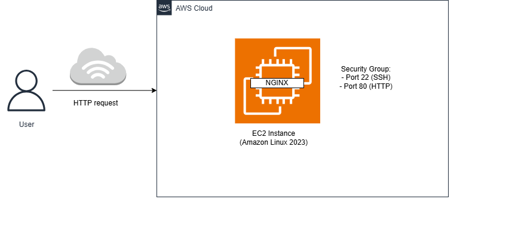

# Deploying a Web Server on AWS EC2 Using Terraform (Nginx Setup)

This project provisions a simple web server on AWS using Terraform. It launches an EC2 instance, configures a security group for SSH and HTTP access, registers an SSH key pair, and uses a user data script to install and start Nginx automatically.

## Project Overview

I built this project to practice Infrastructure as Code with Terraform and strengthen my understanding of AWS fundamentals. Instead of manually clicking through the AWS Console, I used code to define and provision infrastructure.

## What This Project Does

- Configures the AWS provider in `us-east-1`
- Looks up the latest Amazon Linux 2023 AMI
- Creates an AWS key pair from a local public key
- Creates a security group for:
  - SSH on port 22
  - HTTP on port 80
- Launches an EC2 instance
- Runs a user data script to install and start Nginx
- Displays a custom web page in the browser

## Architecture

The diagram below shows how traffic flows from the user to the web server running on AWS.



User → Internet → EC2 Instance → Nginx

Terraform provisions and manages:

- EC2 instance
- Security group
- Key pair

## Files in This Project

- `main.tf` — main infrastructure resources
- `variables.tf` — variable definitions
- `terraform.tfvars` — variable values
- `outputs.tf` — public IP and DNS outputs
- `userdata.sh` — startup script to install and configure Nginx

## Tools Used

- Terraform
- AWS EC2
- AWS Security Groups
- Amazon Linux 2023
- Nginx
- Windows Command Prompt
- VS Code

## How I Built It

1. Initialized Terraform with `terraform init`
2. Validated the configuration with `terraform validate`
3. Reviewed the execution plan with `terraform plan`
4. Applied the configuration with `terraform apply`
5. Opened the public IP in the browser to verify the web server
6. Connected to the instance using SSH

## Key Learning Points

- How to read and use Terraform documentation
- How EC2, security groups, and key pairs work together
- How to restrict SSH access to my own IP
- How to use user data to automate software installation
- How small mistakes like file naming and key paths can break deployments
- How to troubleshoot Terraform errors step by step

## Challenges I Faced

### 1. SSH key confusion

At first, I was confused about private keys, public keys, and where they were stored. I learned that Terraform uses the public key, while SSH uses the matching private key.

### 2. File path and naming issues

A small mismatch in file naming caused Terraform to fail when trying to read the user data script. Fixing the file name solved the issue.

### 3. Security group configuration

I initially mixed examples from the documentation that were not relevant to my project. I later simplified the rules to allow only the traffic I actually needed.

### 4. Understanding AMI selection

Instead of hardcoding an AMI ID, I used a Terraform data source to look up the latest Amazon Linux 2023 AMI.

## Result

The EC2 instance launched successfully, Nginx was installed automatically, and the server displayed:

**Deployed with Terraform by Naomi**

I also connected to the instance successfully through SSH.

## Cleanup

To avoid unnecessary AWS charges, destroy the infrastructure after testing:

```bash
terraform destroy
```
